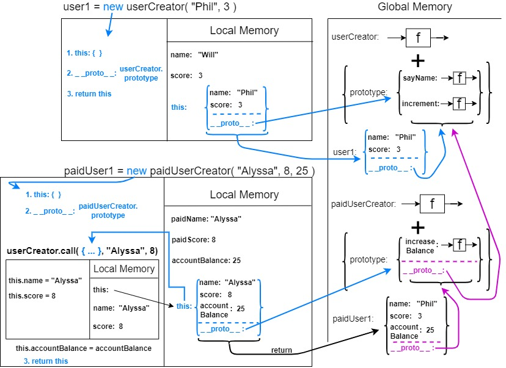

## These are my notes for the course The Hard Parts of Object Oriented JavaScript by Will Sentance. If you want any of this to make any sense, go whatch the course on frontendmasters.com.
<br>


<details>
<summary>Object Creation + Prototype & New</summary>
<br>

# Object Creation + Prototype & New:

## Ways of storing data and functionality
<br>

### Objects (object literals)
Store functions with their associated data!
<br>

Let's create some objects
```javascript
// One way of creating an object literal

const user1 = {
  name: "Phil",
  score: 4,
  increment: function() {
    user1.score++;
  }
};

user1.increment(); //user1.score => 5


// Another way, using dot notation

const user2 = {}; //create an empty object
user2.name = "Julia"; //assign properties to that object
user2.score = 5;
user2.increment = function() {
  user2.score++;
};


// Creating user3 using Object.create

const user3 = Object.create(null); // whatever we pass into it, will always return an empty object
user3.name = "Eva";
user3.score = 9;
user3.increment = function() {
  user3.score++;
};
```

It's pretty obvious that by creating objects (*users* in our case) in this way, we are breaking the DRY principle. Meaning, for each *user* we want to create, we have to write the same code and functionality.
<br>

### Solution 1. Generate objects using a function
```javascript
function userCreator(name, score) {
  const newUser = {};
  newUser.name = name;
  newUser.score = score;
  newUser.increment = function() {
    newUser.score++;
  };
  return newUser;
};

const user1 = userCreator("Phil", 4);
const user2 = userCreator("Julia", 5);
user1.increment()
```
### Problems:
Each time we create a new user we make space in our computer's memory for all our data and functions. But our functions are just copies.
<br>

### Having seen solution 1. what do we want ideally?
To store the increment function in just one object and have the **interpreter**, if it doesn't find the function on *user1*, look up to that object to check if it's there.

### Solution 2. Using the prototype chain and making the link with *Object.create()* technique
```javascript
function userCreator (name, score) {
  const newUser = Object.create(userFunctionStore);
  newUser.name = name;
  newUser.score = score;
  return newUser;
};

const userFunctionStore = {
  increment: function(){this.score++;},
  login: function(){console.log("You're loggedin");}
};

const user1 = userCreator("Phil", 4);
const user2 = userCreator("Julia", 5);
user1.increment();
```
In this way, if the **interpreter** doesn't find **.increment** on *user1*, it looks up the **prototype chain** to the next object and finds **.increment** 1 level up.  
But how does this happen? The *user1* object will have a hidden property **_ _proto\_ _** which, when we create an object using *Object.create(objectPassed)*, will be set to point to *objectPassed*.
So in our example, the interpreter looks into *user1* for its *.increment* method, doesn't find it, then looks into its **_ _proto\_ _**, sees that it links to *userFunctionStore*, looks into that object, and finds the method.
<br>

### Solution 3. Introducing the keyword that automates the hard work: new
```javascript
const user1 = new userCreator("Phil", 4)
```
When we call the constructor function with new in front we automate 3 things
1. Create a new *user* object
2. Return the new *user* object
3. The new *user* object that was returned will have its **_ _proto\_ _** property link to the **prototype** object from *userCreator*

### Interlude - functions are both objects and functions 
```javascript
function multiplyBy2(num){
  return num*2
}

multiplyBy2.stored = 5
// when called with ( ), multiplyBy2 does its "function" duties
multiplyBy2(3) // 6

// whe used with "dot", it does its "object" duties
console.log(multiplyBy2.stored) // 5
console.log(multiplyBy2.prototype) // {}
```
<br>

### So what does the fact that functions are both functions and object have to do with the *new* keyword?
The fact that all functions have a default property on their object version, called **prototype**, which is itself an object - makes it possible to replace our *functionStore* object.

```javascript
function UserCreator(name, score){
  this.name = name;
  this.score = score;
}

UserCreator.prototype.increment = function(){
  this.score++;
};
UserCreator.prototype.login = function(){
  console.log("login");
};

const user1 = new UserCreator(“Eva”, 9)
user1.increment()
```

So lets's focus on the main things tha happen when this code runs:  
* The *user1* constant will be saved in the **Global Memory**, and at first it will be uninitialized.
* The function *UserCreator* will be run with arguments "Eva" and 9, but since it has the **new** keyword in front of it some special things will happen in the function's **Execution Context** in **Local Memory**:  
  * The *name* and *score* parameters will be initialized with the arguments passed into the function
  * A local variable called **this** will also be saved in **Local Memory** and initialized as an empty object.
  * The **this** object will receive two properties called *name* and *score* each having assigned their respective value ("Eva", 9). **BUT**, thanks to the **new** keyword, another parameter will be added to the **this** object, called **_ _proto\_ _**, which is a hidden parameter and will link to *userCreator*'s **prototype** object  
  * The object assigned to **this** will be returned.
* Now *user1* is initialized with the object that was returned from calling *UserCreator*  
* When we call *user1.increment()* the JS interpeter will look inside *user1* for the *.increment* method, will not find it, then it will look on *user1*'s **_ _proto\_ _** property which links to the **prototype** object on *userCreator*, and on that object, the *.increment* method will be found and called.
</details>

<details>
<summary>Scope & this</summary>
<br>

# Scope and *this* keyword:

## IMPORTANT
### The *this* in functions that are called with the *new* keyword is DIFFERENT from the *this* inside normal functions.
### In functions called with *new*, the *this* will get assigned to the *object part* of the function (the object that also has on it the *prototype* object). BUT MOST IMPORTANTLY, IN THIS CASE, THE *THIS* IS CREATED AS A RESULT OF USING THE *NEW* KEYWORD, AND IT AUTOMATICALLY GETS ASSIGNED AN *EMPTY OBJECT* AND WILL AUTOMATICALLY BE RETURNED AFTER THE FUNCTION RUNS.
### In normal functions, the *this* will point to *where* the function is called. If it's called with a *dot* (eg: a.callFunctionOnA), it will get assigned to whatever is on the left of the *dot*. If it's called in the *global context* it will point to the *global Window object*. IN THIS CASE, THE *THIS* IS CALLED AN *IMPLICIT PARAMETER*.
### There are some things that need to be discussed about *this* in arrow functions. We will tackle that subject in the following lines.
<br>

## Interesting considerations about *this*:
### What if we change one of our shared functions (theoretically keeping the same functionality) in this manner:  
<br>

Instead of:
```javascript
UserCreator.prototype.increment = function(){
  this.score++;
};
```

We will have:
```javascript
UserCreator.prototype.increment = function(){
  function add1(){
    this.score++;
  }

  // let's pay special attention to this line
  add1();
};
```

### This way of implementing our *increment* functionality, even though looks equivalent to the first implementation, will actually not work. Why?
### Let's run through the code and see what actually happens:
1. *increment()* is called on *user1*
2. A new **Execution Context** is created.
3. In the **Execution Context**, in it's **Local Memory**, the implicit parameter **this** is saved and gets assigned *user1* (*this: user1*). Also, a parameter called *add1* will be saved and that gets assigned a function (*the function add1 itself*).
4. *add1* function is called
5. Inside the **Execution Context** of *user1.increment()* a new **Execution Context** will be created for *add1*
6. In the **Execution Context** of *add1*, in its **Local Memory**, the implicit parameter **this** will be saved, and **SINCE THE FUNCTION WAS NOT CALLED WITH THE DOT NOTATION**, it will get assigned the **Window** global object (*this: Window*). **So, *this.score++* will basically evaluate to *Window.score++* and since the Window object doesn't have a score property, trying to increment it will result in *NaN*** 


## The solution to fix the situation above - arrow functions which bind *this* lexically

### What does lexical binding mean?
The **this** object inside an **arrow function** is **lexically bound**, which is just a fancy way of saying **its value is static and determined by the scope *this* is defined in**. Contrast that with regular functions, where **this** is **dynamic** and **based on the context it's called regardless of the scope** at the time this was defined.

```javascript
function UserCreator(name, score){
  this.name = name;
  this.score = score;
}
UserCreator.prototype.increment = function(){
  const add1 = ()=>{this.score++}
  add1()
};
UserCreator.prototype.login = function(){
  console.log("login");
};
const user1 = new UserCreator(“Eva”, 9)
user1.increment()
```

So now, when the *increment* function is called, and consequently, the *add* function is called, since it was declared as an **arrow function** and the **this** is now **lexically scoped** instead of **context dependent**. And so, when we run *increment* on *user1*, *add1* function will be declared, defined and run in the **scope** of *user1*, and so it's **this** being lexically scoped, **will point to *user1***, so it will successfully increment the *score*.
<br>

## The *class* "syntactic sugar"
What the **class** keyword does, is make adding methods to our "classes" (function + object combos) easier. Instead of adding them through < functionName >.prototype = < method >, we can add our methods directly inside the *class*.  Also, with the **class** keyword, the function part of the function + object combo, now becomes the **constructor**. 
### Code
```javascript
class UserCreator (name, score) {
  // this replaces the function part of our function + object combo
  // this was basically our UserCreator function
  constructor (name, score) {
    this.name = name;
    this.score = score;
  }
  increment () { this.score++; }
  login () { console.log("login"); }
};

// No longer needed, the methods are directly inside the class now;
// userCreator.prototype.increment = function() {
//   this.score++;
// };
// userCreator.prototype.login = function() {
//   console.log("login");
// }

const user1 = new UserCreator("Will", 3);
```

### It's called *syntactic sugar* because even though we have *class syntax*, under the hood, JavaScript does exactly the same steps from "Solution 3.", it just abstracts the work away from the programmer and provides a more syntactially elegant way of doing things.
</details>

<details>
<summary>Subclassing with Factory Functions</summary>
<br>

# Subclassing with Factory Functions
## Subclassing in Solution 2 - factory function approach


```javascript
function userCreator(name, score) {
  const newUser = Object.create(userFunctions);
  newUser.name = name;
  newUser.score = score;
  return newUser;
}

userFunctions = {
  sayName: function() {
    console.log(`I'm ${this.name}`);
  },
  increment: function() {
    this.score++;
  }
}

const user1 = userCreator("Phil", 5);
user1.sayName(); // "I'm Phil"

// #########################
// Code above is from Solution 2
// Will will focus on the new code below

function paidUserCreator(paidName, paidScore, accountBalance) {
  const newPaidUser = userCreator(paidName, paidScore);
  Object.setPrototypeOf(newPaidUser, paidUserFunctions);
  newPaidUser.accountBalance = accountBalance;
  return newPaidUser;
}

const paidUserFunctions = {
  increaseBalance: function() {
    this.accountBalance++;
  }
};

Object.setPrototypeOf(paidUserFunctions, userFunctions)

const paidUser1 = paidUserCreator("Alyssa", 8, 25);

paidUser1.increaseBalance();
paidUser1.sayName(); // "I'm alyssa"
```

### So what do we want?
We want for our *paid users* to have access to all the *user functions*, but we don't want our normal users to have access to *paidUser functions*. In other wants, we want our *paidUser* to subclass *user*.
### Does the code above achieve what we set out to do?
Yes it does.
### How?
We will start at this line: 
```javascript
const newPaidUser = userCreator(paidName, paidScore);
```
What is returned and saved into *newPaidUser* after *userCreator* runs, will be an object that will have a *name* and a *score* property, but also, its **_ _proto\_ _** property will link to *userFunctions*.  
But we want our *paidUser*'s **_ _proto\_ _** to link to our *paidUserFunctions*. Also, we want our *paidUser* to have an extra property form the *normal user*, and that property is *account balance*, so we will also add it to the object returned by running *userCreator*. 
```javascript
// the __proto__ of newPaidUser will link to paidUserFunctions now
 Object.setPrototypeOf(newPaidUser, paidUserFunctions);

 // we add the accountBalance property
 // which is specific to paidUsers
  newPaidUser.accountBalance = accountBalance;
```
But as we said, we want our *paidUser* to also have access to methods from regular users (*userFunctions*). To do so, we will set the **_ _proto\_ _** of the *paidUserFunctions* object to link to *userFunctions*.
```javascript
Object.setPrototypeOf(paidUserFunctions, userFunctions)
```

And without even knowing it we have achieve all our goals about *paidUser* subclassing *userCreator*.
</details>

<details>
<summary>Subclassing with new and call</summary>
<br>

# Subclassing with *new* and *call*:
## Subclassing in Solution 3

### Note: Please watch the course for any of this to make sense

```javascript
function userCreator(name, score) {
  this.name = name;
  this.score = score;
}

userCreator.prototype.sayName = function() {
  console.log(`I'm ${this.name}`);
}
userCreator.prototype.increment = function() {
  this.score++;
}


const user1 = new userCreator("Phil", 5);
user1.sayName(); // "I'm Phil"

// #########################
// Code above is from Solution 3
// Will will focus on the new code below

function paidUserCreator(paidName, paidScore, accountBalance) {
  userCreator.call(this, paidName, paidScore);
  //userCreator.apply(this, [paidName, paidScore])
  this.accountBalance = accountBalance;
}

paidUserCreator.prototype = Object.create(userCreator.prototype);


  paidUserCreator.prototype.increaseBalance = function() {
  this.accountBalance++;
}

const paidUser1 = new paidUserCreator("Alyssa", 8, 25);

paidUser1.increaseBalance();
paidUser1.sayName(); // "I'm alyssa"
```

Code execution diagram:  


### Short rundown of the code:
1. We call *paidUserCreator* with **new** in front
2. A new **Execution Context** will be created
3. Since we called it with **new**, an empty object will be automatically created and assigned to **this**.
4. The **_ _proto\_ _** property on this newly created object will link to *paidUserCreator* **prototype** object - this happens again automatically, because of the **new** keyword
5. Now we run *userCreator.call( ... )* so in the **Execution Context** of *paidUserCreator*, another **Execution Context** will be created.
6. Since we ran the *userCreator* function with *.call()* ,the implicit parameter **this** (used inside *userCreator* for *this.name* and *this.score* assignments) will get assigned to it a reference to **the auto-created, empty object also called *this* from *paidUserCreator***, and since we did not run *userCreator* with **new**, it will run as a normal function, simply doing the assignments (*name* to *name* and *score* to *score*). So we can translate *this.name = name* to *paidUserCreator.name = paidName* (of course, that's not exactly how it works, but it's a generalization for learning purposes) 
6. Now we get out of *userCreator.call( ... )* and our **this** object has on it a *name* and *score* property and the respective values, and next we add to it *accountBalance*
7. In the last step, since we called *paidUserCreator* with **new**, the **this** object will get automatically returned.

### What does this do though?
```javascript
paidUserCreator.prototype = Object.create(userCreator.prototype);
```
Since we want our *paidUserCreator* to "inherit" from userCreator, this code will do just that. How?
When *Object.create()* runs it always returns an empty object **AND** assigns to the **_ \_proto\_ \_** property of that empty object, whatever it was passed as an argument when the ".create()" function was called. So in our case, we **override** the empty **prototype** object on *paidUserCreator* with another empty object, **that has its *_ _proto\_ _* property linked to *userCreator* prototype object**

</details>